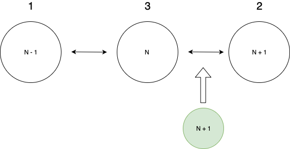

# About
In this work was implemented parallel loading pages. It can be specified how many parallel tasks could be executed at the same time. The pool of tasks was implemented using `async`. Also, there is a retry functionality.

Pls. have fun! :P

## Algorithm

  

 

 All requests (responses) are linked to each other with a doubly-linked list.  
 Rules:
 - If the response of page N has the same total as response N + 1 => they are full, so we do nothing.
 - If the response of page N has an intersection with N + 1 (means some items were inserted before) they are full, so we do nothing.
 - If the response of page N doesn't have intersections with N + 1 and total numbers of both are different we create a new request to load page N + 1 recursively as insertions could be bigger then 1 page

## Setup
- run `npm install` in the root directory
- run `mv .env.example .env` in the root directory

## Commands
- `npm run start` to run and display results
- `npm run test` to run unit tests
- `npm run integration` to run integration tests

## Troubleshootings
### 'mocha' command not found
- if you are on mac you have to use sudo npm install -g mocha